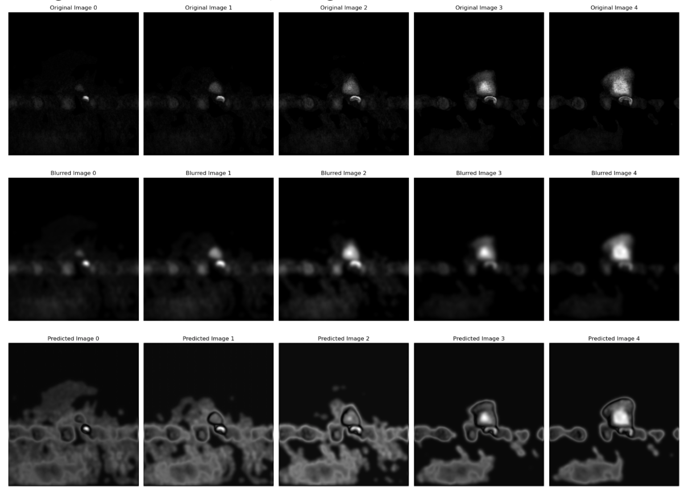

# MRI_Image_Recovery

## Introduction
This is part of my work for the CIG lab.
The image data type is complex, which includes the real and imag.

## Data Set 
Download the dataset from this link, https://zenodo.org/records/6481291

## Model
Customed U_Net

## Result
The best results for image recovery are following.
 
Average PSNR: 28.47056291727579, Average SSIM: 0.787660166949376
 

## Imporve
Currently, the layer of U-net is a little bit of shallow. And the more deeper network will prove the perfermance of model.
